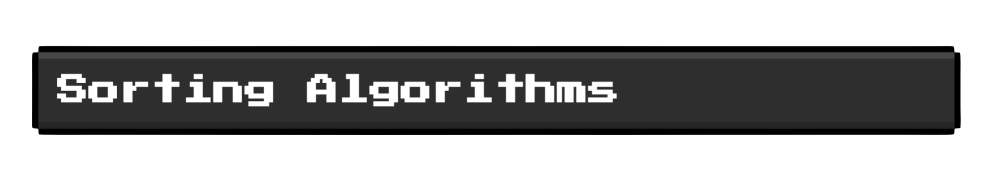
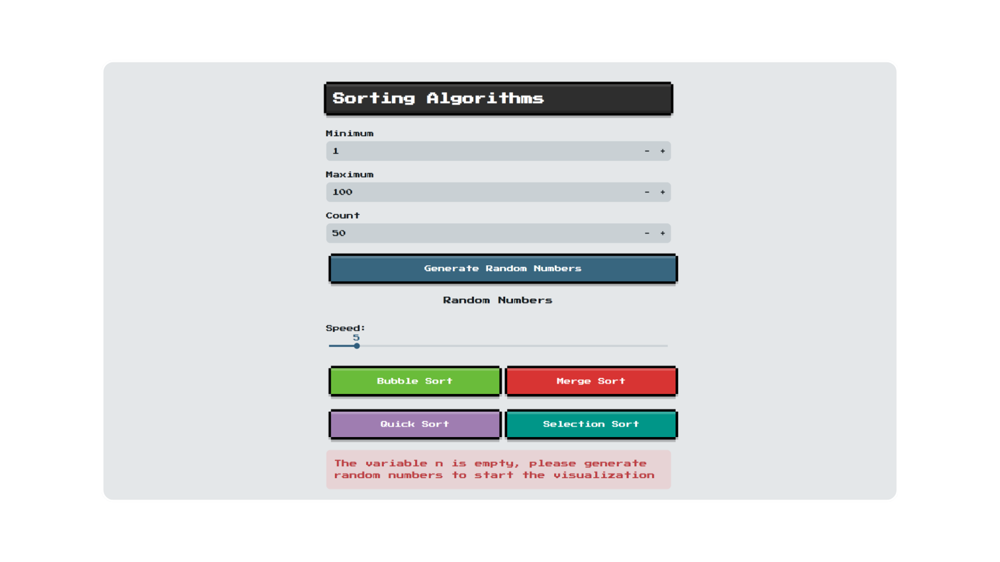
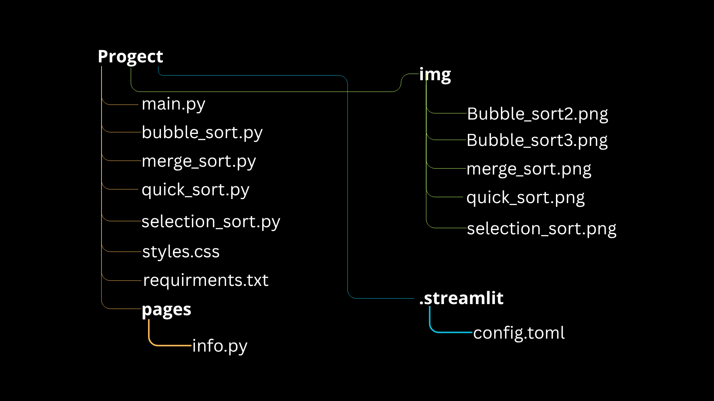
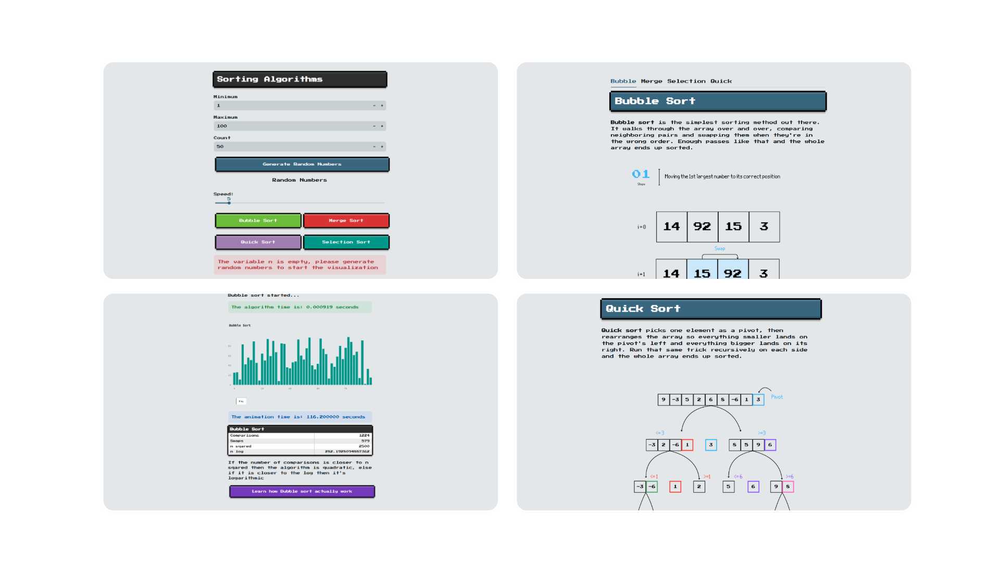

<p align="center">
  
</p>

<p align="center">
  <i>A retro-style sorting algorithm visualizer built with Streamlit and Plotly.</i>
</p>

<p align="center">
  <a href="https://python-sorting-visualizer.streamlit.app/"></a>
  <a href="https://github.com/user-attachments/assets/cfd97cb9-4797-4f6d-8ec0-160b88038156"></a>
  <a href="#license"></a>
</p>  

## What it does

Generates a random array, then animates it being sorted with bubble sort, merge sort, quick sort, or selection sort, so you can actually see how each algorithm moves through the data. Alongside the animation, it shows live stats on comparisons and swaps, so the difference between an O(n²) algorithm and an O(n log n) one is visible, not just theoretical.

There's also an info page explaining how each algorithm works, with diagrams I made in Canva.



## Run it locally

```bash
git clone https://github.com/FlXZ22/python-sorting-visualizer.git
cd python-sorting-visualizer
pip install -r requirements.txt
streamlit run main.py
```

## How it's built

I wrote each sorting algorithm as a function that takes an unsorted array and returns a list of snapshots, one per step, each one storing the array's state at that point plus which indices are being compared or swapped. `main.py` imports all of these and feeds the snapshots into Plotly to animate them.

For large arrays, recording every single step made the animation laggy, so I added a class in `utils.py` that only takes a snapshot every fixed interval instead, depending on which algorithm is running.

## File breakdown


- **main.py** - the core file. Imports the sorting functions, has the title and the input boxes for the number generator (min, max, count), with validation: error if min > max, error if count > max. Four buttons, one per algorithm, each one builds a graph plus a "Play" button. Also times sort speed versus animation length, and has an HTML table (design copied from a CSS library) for comparisons, swaps, n squared, n log. One more button links to the info page.
- **bubble_sort.py, merge_sort.py, quick_sort.py, selection_sort.py** - each has one function, `*_sort_steps`, that returns the snapshot list for that algorithm.
- **utils.py** - the class that builds the snapshot dictionaries and throttles them when the count is large.
- **requirements.txt** - libraries needed to run it.
- **assets/** - the graphs explaining each algorithm; I made these in Canva.
- **pages/** - `info.py`, the Streamlit page that explains how each algorithm works; you get there from a button in main.py.
- **styles.css** - loaded by main.py and pages/info.py through `load_css`, reads the file into a `css` variable and injects it with `st.markdown(f"<style>{css}</style>", unsafe_allow_html=True)`.
- **.streamlit/** - `config.toml`, background color, font, other page settings.



## Design choices

I picked Streamlit because it was an easy first pick for me. I found it before I found Flask and other libraries.

I gave the program a retro style because I think it makes it look different from other sorting visualizers out there.

The first version used a different library for static graph images; I switched to Plotly once I decided I wanted the graphs animated instead.

For the snapshot list, I used a simple class to keep the code organized, and it also taught me how classes work in Python.

I added the comparisons/swaps table so whoever's using it can actually see what makes an algorithm quadratic instead of logarithmic, not just read about it.

## AI use

No code here was AI-generated. I used Claude to debug and get explanations for things I didn't understand yet, and Grammarly to clean up this README.

## License

MIT

---

## Demo video

https://github.com/user-attachments/assets/cfd97cb9-4797-4f6d-8ec0-160b88038156

<p align="center">
  <b><a href="https://github.com/FlXZ22">Metis</a></b> · 16 · self-taught · Milan
</p>
