<p align="center">
  
</p>

<p align="center">
  <a href="https://python-sorting-visualizer.streamlit.app/">Live demo</a> ·
  <a href="https://youtu.be/oMnjDsNMJmI">Video walkthrough</a> ·
  <a href="https://github.com/FlXZ22/python-sorting-visualizer">GitHub</a>
</p>

<p align="center">
  
  
  
</p>

<p align="center">
  
</p>

## What it does

Generates a random array, then animates it being sorted with bubble sort, merge sort, quick sort, or selection sort, so you can actually see how each algorithm moves through the data. Alongside the animation, it shows live stats on comparisons and swaps, so the difference between an O(n²) algorithm and an O(n log n) one is visible, not just theoretical.

There's also an info page explaining how each algorithm works, with diagrams I made in Canva.

## Run it locally

```bash
git clone https://github.com/FlXZ22/python-sorting-visualizer.git
cd python-sorting-visualizer
pip install -r requirements.txt
streamlit run main.py
```

## How it's built

I wrote each sorting algorithm as a function that takes an unsorted array and returns a list of snapshots, one per step, each one storing the array's state at that point plus which indices are being compared or swapped. `main.py` imports all of these and feeds the snapshots into Plotly to animate them.

For large arrays, recording every single step made the animation laggy, so I added a class in `utils.py` that only takes a snapshot every fixed interval instead, depending on which algorithm is running.

## File structure

- `main.py` — the app itself: array generator, algorithm buttons, animation, timing, and the comparisons/swaps table
- `bubble_sort.py`, `merge_sort.py`, `quick_sort.py`, `selection_sort.py` — one implementation each, all returning step snapshots
- `utils.py` — the snapshot class and the throttling logic for large arrays
- `styles.css` — the retro theme
- `pages/info.py` — the algorithm explanation page
- `img/` — the diagrams I made for the info page
- `.streamlit/config.toml` — theme settings

## Why I built it this way

I picked Streamlit because it was the first framework I'd found, before I even knew Flask existed, and it let me get straight to the algorithms instead of fighting with frontend setup. The retro look is just a personal choice, I wanted it to look different from the usual sorting visualizer.

Originally I used a different library that only made static images. I switched to Plotly because I wanted the sorting to actually animate, not just show before/after.

I used a simple class to structure the snapshots, partly to keep the code organized, partly because it was my first real use of classes in Python.

## AI use

No code here was AI-generated. I used Claude to debug and to get explanations for things I didn't understand yet, and Grammarly to clean up this README.

---

<p align="center">
  <b><a href="https://github.com/FlXZ22">Metis</a></b> · 16 · self-taught · Milan
</p>